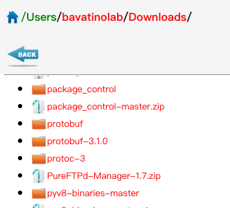

# Description

A simple TCP/IP server like Apache, but small and exquisite. Anywhere it's very very simple right now, and doesn't have many complex functions. Remember until now, this project only support HTTP/1.1 protocol and java 1.7+.

# How to Use it

After clone the source code, first of all, you should run 'gradle wrapper' to build the gradlew environment.

At the root of project, you can see the shell named 'run.sh'. Simply, run that command, and you can get outputs from console.

``` txt
二月 18, 2017 11:57:48 下午 com.peterliu.peterrabbit.channel.SelectorRegister startServer
信息: Server started up at bavatinolabdeMacBook-Pro.local/192.168.1.102:8301
```
And open a web tab in your browser, tap into the address, that you receive it from your console.



# How to Config it

There are many configuration properties, you can config them using JVM or System Properties. If you using JVM property, you should modify shell 'run.sh', for example,

> java -Dcom.peterliu.peterrabbit.file.suffix=rar

Here is the table show all properties.

| name | description | default value |
| --- | --- | --- |
|com.peterliu.peterrabbit.file.path| root path for your resources | / |
|com.peterliu.peterrabbit.file.suffix| file suffix used to filter files, any others are not supported, and you will get 'unsupported file type' on your website| json,java,html,htm,js,png,jpg,txt,css,pptx,vm,xml,jar,pdf,sh,bat,md,c,c++,jpeg,doc,docx,ppt,gif|
|com.peterliu.peterrabbit.file.suffix.default|default suffix. if the url does not assign a suffix to load file resource, this default suffix will be used|json|
|com.peterliu.peterrabbit.server.port|server port|8300|
|com.peterliu.peterrabbit.handler.curr.coresize|core size of thread pool, and max size equal to coresize * 100|5|
|com.peterliu.peterrabbit.server.file.dictionary.filter.switch|whether switch( on/off ) of the file list display filter.|off|
|com.peterliu.peterrabbit.client.cache.maxage|max cache time on client side(seconds)|1 hours|
